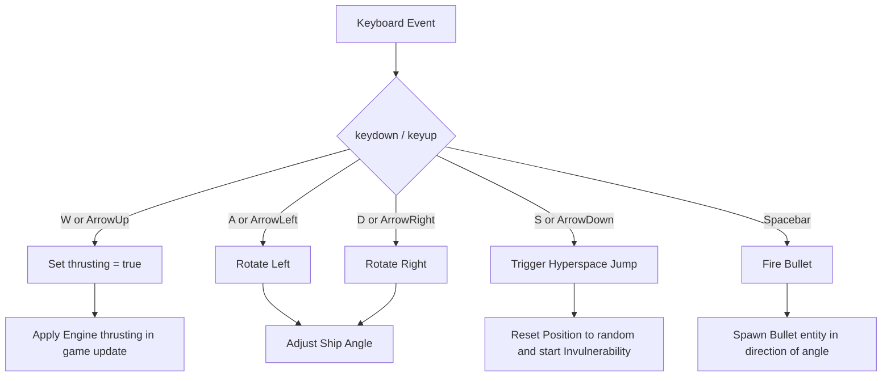

# Design Document: Support Arrow Keys and Title Screen Controls

## 1. User Story

- **Headline**: Support Arrow Keys for ship control and update the title screen instructions to list both input methods.
- **Problem Statement**: Currently, players can only control the ship using the WASD keys and S for hyperspace, which can be restrictive or unintuitive for players accustomed to classic arcade arrow key controls. Additionally, the title screen only lists WASD controls, omitting any mention of alternative arrow keys.
- **Objective**: Add simultaneous support for Arrow Keys (Up Arrow for thrust, Left/Right Arrows for rotation, Down Arrow for Hyperspace) alongside the existing WASD/S controls. Update the title screen layout to cleanly and concisely inform the player of these options using the Option C presentation style.
- **Expected Outcome**: Players can control the ship seamlessly using either WASD/S or Arrow Keys (including mixing them), and the title screen displays clean, updated instructions without cluttering the screen or doubling movement acceleration.

## 2. Implementation Backlog

## Pending

- `01-implement-arrow-keys-and-hyperspace.md`: Update input handling in `src/game.ts` to map Arrow Keys (`arrowup`, `arrowleft`, `arrowright`, `arrowdown`) and handle dual-input states cleanly.
- `02-update-title-screen-instructions.md`: Modify `drawMenu` inside `src/game.ts` to output Option C instructions reflecting the dual movement input and Hyperspace keys.
- `03-add-input-handling-tests.md`: Update the co-located tests in `src/game.test.ts` to cover the new key controls and ensure robust coverage.

## Current

(None)

## Completed

(None)

## 3. Architecture Overview

### File Tree

The additions/changes are contained entirely within the existing files:

```
asteroids/
└── src/
    ├── game.ts                  # Update input listeners (keydown/keyup) and drawMenu instructions
    └── game.test.ts             # Co-located unit tests to verify control and collision behaviors
```

### Mermaid Diagram



## 4. Checklist & Requirements

### Functional Requirements

1. **Dual Controls & Simultaneous Support**:
   - The ship must support **simultaneous** WASD and Arrow Keys bindings.
   - **Thrust**: Either `W` or `ArrowUp` (`arrowup`) triggers ship forward thrust.
   - **Rotate Left**: Either `A` or `ArrowLeft` (`arrowleft`) rotates the ship counter-clockwise.
   - **Rotate Right**: Either `D` or `ArrowRight` (`arrowright`) rotates the ship clockwise.
   - **Hyperspace**: Either `S` or `ArrowDown` (`arrowdown`) triggers a hyperspace jump.

2. **Conflict Resolution / Input Safeguards**:
   - **Acceleration Protection**: If a user holds both `W` and `ArrowUp` at the same time, the ship's thrusting state remains singular (thrusting speed/acceleration must NOT double).
   - **Rotation Canceling**: If a user holds opposing controls (e.g., `A` + `ArrowRight` or `ArrowLeft` + `D`), the rotation inputs must cancel each other out (net zero rotation).

3. **Title Screen Controls Presentation (Option C style modified for accuracy):**
   - The game title screen `drawMenu()` should be updated to show:
     ```text
     WASD OR ARROW KEYS TO MOVE
     SPACE = SHOOT | S/DOWN = HYPERSPACE
     ```
   - Make sure any updated text fits perfectly within the fixed Canvas coordinates viewport space (`800x600`) without clipping or alignment bugs.

4. **Browser Default Prevention**:
   - Ensure `ArrowUp`, `ArrowDown`, `ArrowLeft`, and `ArrowRight` continue to have `e.preventDefault()` called in `setupInput()` to prevent browser window scrolling during intense play.

### Non-functional Requirements

1. **Deterministic Testing**:
   - New keyboard handler flows must be thoroughly tested in `src/game.test.ts`.
   - Ensure test suite achieves 100% code coverage.
   - No performance overhead should be introduced to the input listener.
