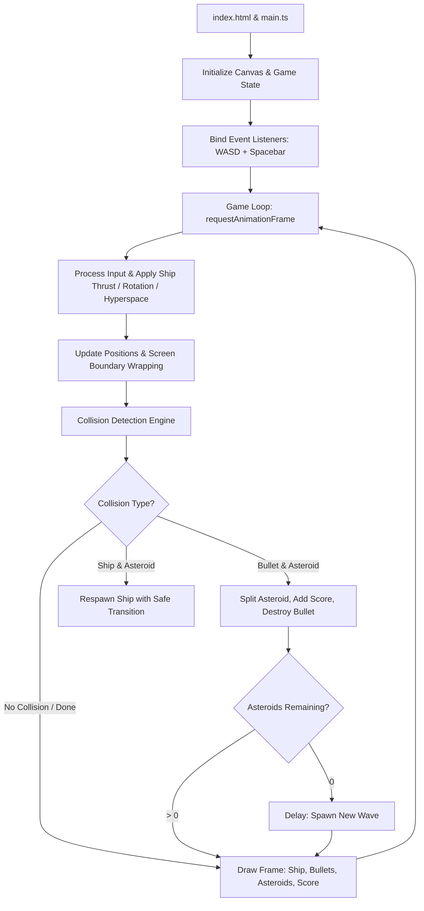

# Design Document: Asteroids Clone

## 1. User Story

- **Headline**: Single-player retro Asteroids clone running directly in the browser via HTML5 Canvas and TypeScript.
- **Problem Statement**: The project lacks an interactive, visually engaging, and responsive browser game showcasing retro arcade vector aesthetics and inertial physics.
- **Objective**: Deliver a fully playable static single-player Asteroids clone, built with HTML5 Canvas and TypeScript, featuring inertia physics, screen wrapping, asteroid splitting, score tracking, retro vector art styles, and infinite lives.
- **Expected Outcome**: The user receives a static single-page web app folder that can be served directly from any CDN or static hosting platform, containing an interactive game canvas controllable with WASD + Spacebar.

## 2. Implementation Backlog

## Pending

- `01-scaffold-project-structure.md`: Initialize Vite project with TypeScript, configure config files, and establish index.html canvas element.
- `02-implement-physics-and-wrapping.md`: Establish coordinate system, movement vectors, screen boundary wrapping, and utility functions for inertial drag and velocity clamping.
- `03-implement-player-ship.md`: Build the triangular ship entity with rotational movement (A/D), forward thrust (W), hyperspace jump (S), and inertial drift.
- `04-implement-bullets-and-shooting.md`: Create bullets with a maximum limit of 6 on-screen simultaneously, applying lifetime rules.
- `05-implement-asteroids-and-division.md`: Render irregular circular asteroids of 3 sizes, implement movement, division into smaller sub-asteroids upon bullet hits, and score attribution.
- `06-implement-collision-detection.md`: Implement circle-to-point and circle-to-circle collision logic between asteroids, bullets, and ship.
- `07-implement-game-loop-and-state.md`: Integrate score rendering, state management (Menu, Active, Game Over/Respawn), and next-wave delay spawning.

## Current

(None)

## Completed

(None)

## 3. Architecture Overview

### File Tree

```
asteroids/
├── index.html                   # HTML entry point with <canvas> element
├── package.json                 # Project dependencies (Vite, TypeScript)
├── tsconfig.json                # TypeScript configuration
├── src/
│   ├── main.ts                  # Canvas initialization, event listeners, main loop entry
│   ├── game.ts                  # GameState and Loop manager
│   ├── styles.css               # CSS for retro font styling, canvas alignment, and CRT filter
│   ├── entities/
│   │   ├── ship.ts              # Player ship entity (inertia, rotational thrust, hyperspace)
│   │   ├── bullet.ts            # Bullet entity (limited to 6, lifetime)
│   │   └── asteroid.ts          # Asteroid entity (3 sizes: big, medium, tiny)
│   └── utils/
│       ├── physics.ts           # Screen wrapping, speed clamps, and vector math
│       └── collision.ts         # Circle-to-circle and circle-to-point detection logic
```

### Mermaid Diagram



## 4. Checklist & Requirements

### Functional Requirements

1. **Screen Wrapping**: All entities (ship, bullets, asteroids) wrap seamlessly across screen boundaries (top/bottom, left/right).
2. **Player Ship**:
   - Drawn as an outline triangle with the pointy end representing the bow/firing point.
   - `W` key applies continuous acceleration (thrust) in the direction the ship is pointing.
   - Releasing `W` stops acceleration but allows the ship to glide under classic inertia (friction/drag slowly decreases velocity over time, but no instant stop).
   - `A` rotates the ship left; `D` rotates the ship right.
   - `S` instantly teleports the ship to a random location on the screen (Hyperspace).
   - `Spacebar` fires bullets.
3. **Bullets**:
   - Fired from the front tip of the ship.
   - Fixed speed, traveling in the direction the ship was pointing when fired.
   - Maximum of **6 bullets** on screen at any one time.
   - Disappear after a set lifetime or upon collision.
4. **Asteroids**:
   - Drawn as roughly circular outlines with rough/jagged edges to mimic retro vector art.
   - Exist in three sizes: Big (50 pts), Medium (75 pts), and Tiny (100 pts).
   - Big splits into 2 Mediums; Medium splits into 2 Tinies; Tiny is completely destroyed.
   - Initial wave count increases dynamically or respawns upon clearance.
5. **Collision Detection**:
   - Treated as circle-circle (asteroid to ship, asteroid to asteroid) and circle-point (asteroid to bullet) calculations for computational efficiency and smooth gameplay.
6. **Game Loop & Flow**:
   - Infinite lives: Ship resets to the center of the screen when hit, with a brief safe invulnerability window or clear center area.
   - Score display: Rendered in retro vector-style text in the top left/center.
   - Next wave transition: After a delay of 2-3 seconds after the last asteroid is destroyed, spawn a new, slightly faster/more numerous wave of large asteroids.

### Non-functional Requirements

- **Visual Style**: Retro 1970s vector aesthetic: high-contrast white-on-black wireframes, thin glowing strokes.
- **Performance**: Locked at a target framerate of 60 FPS using standard canvas `requestAnimationFrame`.
- **Layout**: Responsive layout: Canvas centered horizontally and vertically, adapting to standard screen aspect ratios (ideally locked 4:3 or 16:9 box).
- **Tooling**: Pure TypeScript implementation with zero external runtime rendering engines (using native HTML5 Canvas 2D Rendering Context).
