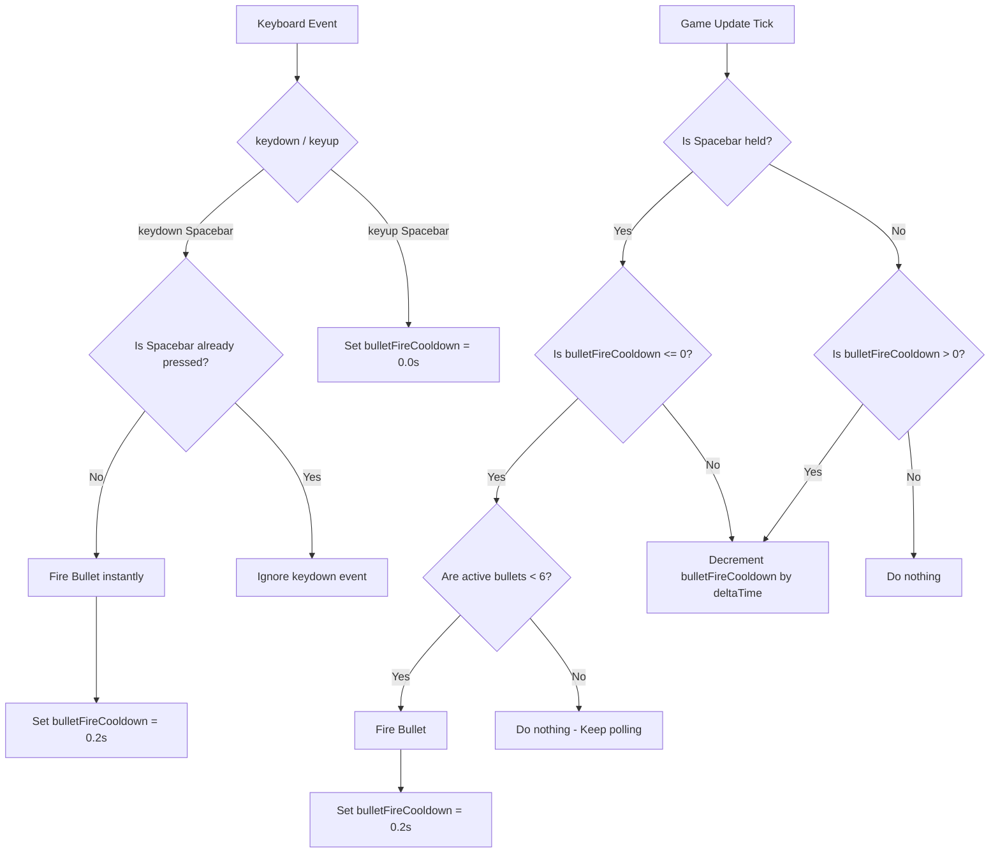

# Design Document: Continuous Fire

## 1. User Story

- **Headline**: Support continuous automatic firing when holding down the Spacebar, while maintaining full responsiveness for rapid manual tapping.
- **Problem Statement**: Currently, players can only fire a single bullet per press of the Spacebar. To fire rapidly, players must repeatedly mash the button (semi-automatic firing). This can be physically tiring and less accessible.
- **Objective**: Implement continuous automatic firing when the Spacebar is held down, at a controlled rate of 5 shots per second (200ms cooldown). Maintain full responsiveness for manual tap-firing by immediately resetting the cooldown to zero as soon as the Spacebar is released.
- **Expected Outcome**: Players can hold down the Spacebar to fire a continuous stream of bullets (up to the maximum of 6 active bullets). Alternatively, players who quickly tap the Spacebar can still fire at their manual tapping rate without artificial delays.

## 2. Implementation Backlog

## Pending

(None)

## Current

(None)

## Completed

- `01-implement-continuous-fire.md`: Update input handling, keyboard listeners, and the game update loop in `src/game.ts` to implement the 200ms cooldown, first-shot responsiveness, continuous polling when the 6-bullet limit is reached, and instant cooldown reset on Spacebar release.
- `02-update-input-handling-tests.md`: Update co-located tests in `src/game.test.ts` to cover the new automatic firing, tap-firing responsiveness, cooldown ticks, and bullet limit interaction.

## 3. Architecture Overview

### File Tree

The changes are localized entirely within the existing files:

```
asteroids/
└── src/
    ├── game.ts                  # Update setupInput keyboard listeners, add bulletFireCooldown state, and update game loop
    └── game.test.ts             # Co-located unit tests to verify continuous and manual firing behavior
```

### Mermaid Diagram



## 4. Checklist & Requirements

### Functional Requirements

1. **Firing Rate (200ms Cooldown)**:
   - Holding down the Spacebar must fire bullets continuously at an interval of exactly **200ms** (5 shots per second).
   - This must be managed using the delta time passed to the update loop (`deltaTime`) to ensure frame-rate independent timing.

2. **First-Shot Responsiveness**:
   - Pressing the Spacebar must trigger an **instant** bullet shot on the initial `keydown` event.
   - The cooldown timer must then be set to `0.2` seconds.

3. **Limit Handling via Continuous Polling**:
   - The project-wide limit of **6 active bullets** on screen must be respected.
   - If the Spacebar is held down and the cooldown timer has elapsed, but there are already 6 active bullets on screen, the game must continuous-poll.
   - As soon as an active bullet decays or collides with an asteroid (reducing the count below 6), a new bullet must fire immediately (on the next frame update) if the Spacebar is still held, resetting the cooldown to `0.2` seconds.

4. **Instant Cooldown Reset on Release**:
   - Releasing the Spacebar (`keyup` event) must instantly reset `bulletFireCooldown` to `0` seconds.
   - This ensures rapid manual tapping bypasses the 200ms continuous-fire limit, allowing players who tap very fast to achieve up to the physical maximum frame-rate limit (or the 6-bullet limit).

5. **State Placement**:
   - The firing cooldown state (`bulletFireCooldown: number`) must be tracked inside the `Game` class in `src/game.ts`.
   - It must be initialized to `0` and reset appropriately when starting/resetting games.

### Non-functional Requirements

1. **Deterministic Testing**:
   - Co-located tests must be added to `src/game.test.ts` to thoroughly verify:
     - Instant first-shot on initial keypress.
     - 200ms continuous firing rate while holding down the Spacebar.
     - Cooldown reset to 0 on release.
     - High-speed manual tapping triggers bullets without artificial cooldown delays.
     - Polling behavior when hitting the 6-bullet limit.
   - The testing suite must achieve 100% code coverage for the new code paths.
