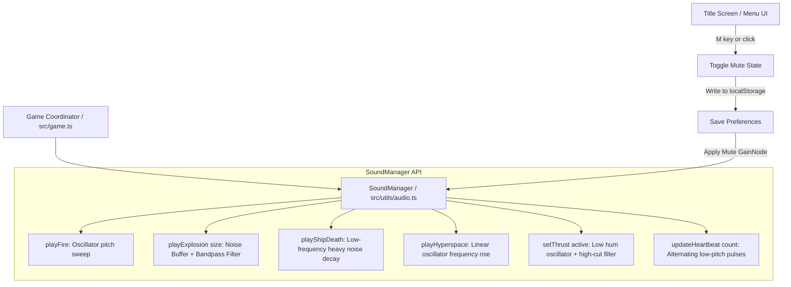

# Design Document: Procedural Audio System

## 1. User Story

- **Headline**: High-fidelity procedural audio synthesis system for retro Asteroids clone using raw Web Audio API.
- **Problem Statement**: The game is currently completely silent, which reduces immersion and fails to capture the classic 1979 arcade atmosphere driven by the iconic escalating heartbeat background rhythm and synthesizer-like sound effects.
- **Objective**: Deliver a decoupled, performant, and asset-less sound system (`SoundManager`) using the native browser Web Audio API. This will dynamically synthesize shooting, explosion, thrust, and hyperspace sounds, as well as an escalating background heartbeat, while supporting persistent muting across browser sessions.
- **Expected Outcome**: The game includes full procedural audio feedback for all player inputs, collisions, and gameplay states. A mute toggle on the title screen allows players to silence the game with state persistence saved in `localStorage`.

## 2. Implementation Backlog

## Pending

- `01-create-sound-manager.md`: Build a decoupled `SoundManager` class in `src/utils/audio.ts` utilizing the browser's Web Audio API to procedurally synthesize retro arcade sound effects (laser fire, asteroid explosions, ship thruster engine, hyperspace jump, ship explosion) without loading external audio assets.
- `02-implement-escalating-heartbeat.md`: Integrate an alternating two-note heartbeat (high/low pitch) background rhythm that dynamically speeds up as the number of on-screen asteroids decreases.
- `03-integrate-audio-triggers.md`: Wire the `SoundManager` methods into the central `Game` coordinator in `src/game.ts` to trigger sounds on laser firing, asteroid splitting, ship collision, ship thrusting, wave transition, and hyperspace jump.
- `04-implement-mute-toggle.md`: Add a persistent mute/unmute button on the canvas title/menu screen using browser `localStorage` to save user mute preferences.
- `05-add-audio-test-mocks.md`: Add testing coverage and mocks for `SoundManager` to ensure standard tests run flawlessly in Node/Vitest environments.

## Current

(None)

## Completed

(None)

## 3. Architecture Overview

### File Tree

```
src/
├── main.ts              # Animation loop (checks interactions to resume AudioContext)
├── game.ts              # Trigger audio events on action, manage menu mute state
├── styles.css           # Styling
├── entities/            # (No file changes needed, Game triggers sounds)
└── utils/
    ├── physics.ts
    ├── collision.ts
    └── audio.ts         # NEW: Procedural Audio Synthesis and Sound Manager Service
```

### Mermaid Diagram



## 4. Checklist & Requirements

### Functional Requirements

1. **Procedural Sound Synthesis**:
   - **Laser Fire**: Synthesized using an oscillator (e.g., triangle or square wave) sweeping down rapidly from high frequency (e.g., 880 Hz) to low frequency (e.g., 110 Hz) over ~0.15 seconds.
   - **Explosions**: Created on-the-fly using procedural White Noise. To generate white noise, create an `AudioBuffer` filled with random floating-point values from `-1.0` to `1.0`. Play it through a bandpass filter (`BiquadFilterNode`) and a fast gain decay envelope:
     - *Large Asteroid*: Deep rumble. High-cut/low-pass filter around 200 Hz with 0.5s decay.
     - *Medium Asteroid*: Medium crash. Bandpass filter around 500 Hz with 0.3s decay.
     - *Small Asteroid*: High-pitched snap. Bandpass filter around 1000 Hz with 0.15s decay.
     - *Ship Death*: Aggressive, long heavy rumble. Bandpass filter around 150 Hz with 1.2s decay.
   - **Ship Thruster Engine**: Sustained low-frequency oscillator hum (e.g. triangle wave at 60-80 Hz) filtered with a low-pass filter, active as long as the player holds `W`.
   - **Hyperspace Jump**: An oscillator with a rapid upward frequency sweep (e.g., 100 Hz to 2000 Hz) over 0.2s.
2. **Escalating Background Heartbeat**:
   - An alternating two-note rhythm (e.g. Note A: 110 Hz, Note B: 98 Hz) that repeats continuously during active gameplay.
   - The pulse interval starts slow (e.g., every 1.0 second) and dynamically speeds up (e.g., down to every 0.25 seconds) proportional to the remaining number of asteroids on the board:
     $$\text{Interval} = \max\left(0.25, \min\left(1.0, 0.25 + \frac{\text{Asteroids Count}}{10} \cdot 0.75\right)\right)$$
   - Heartbeat must pause when the game is in `MENU` state or `waveTransitionActive` is running.
3. **Autoplay Handling**:
   - Browser safety regulations block audio initialization before a user event. 
   - We must initialize and/or resume the `AudioContext` on any explicit keyboard event (like pressing Enter to start or W/A/S/D during MENU state).
4. **Persistent Muting Toggle**:
   - A mute setting accessible via a visual prompt on the Menu title screen.
   - Toggle mute on pressing the `M` key.
   - Save the state to `localStorage` under the key `asteroids_sound_muted` (value `'true'` or `'false'`) so it is persistent across reload and tab closure.
   - Apply a central master `GainNode` with value `0` (muted) or `1` (unmuted) to silence all synthesized nodes instantly.
5. **Node-Vitest Environment Mocking**:
   - Because `window.AudioContext` is undefined in JSDOM / Vitest, create a stubbed, safe initialization of `SoundManager` that does not crash the app or test runs if Web Audio API is unavailable.
   - Add simple unit tests for `SoundManager` ensuring mute preferences read/write to `localStorage` correctly and functions do not throw errors.

### Non-functional Requirements

- **Zero External Assets**: Completely asset-less implementation. No `.mp3`, `.wav` or other audio downloads.
- **Latency**: Sub-20ms audio latency by using the high-performance Web Audio API instead of standard `<audio>` tags.
- **Compatibility**: Supports all modern standard browsers (Chrome, Firefox, Safari, Edge).
- **Audio Quality**: 44.1 kHz default browser audio sample rate, keeping volume levels safe (Gain values bounded <= 0.3 to prevent ear-damage).
